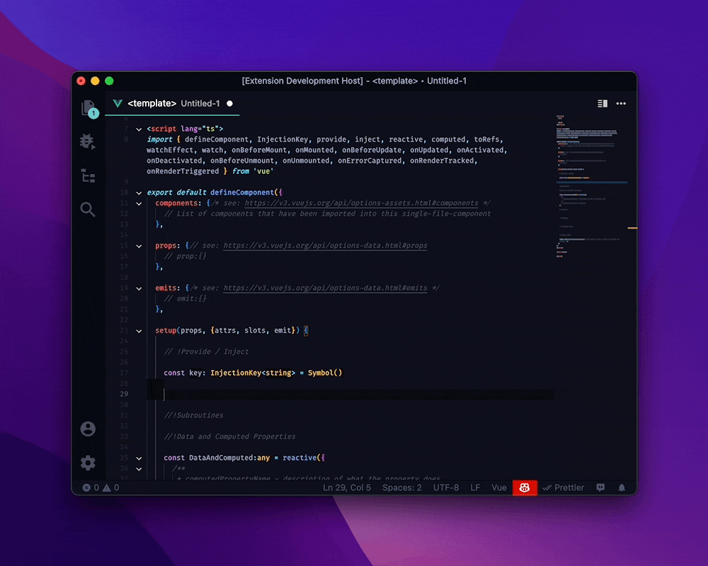
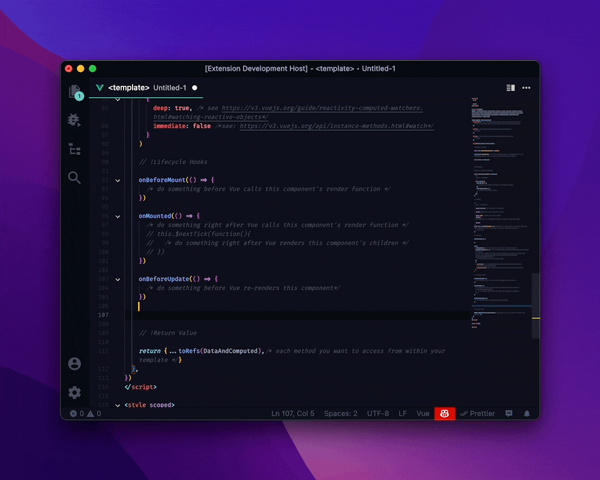
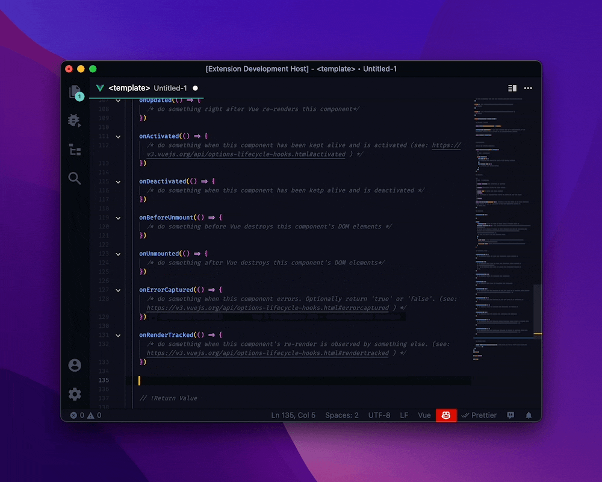
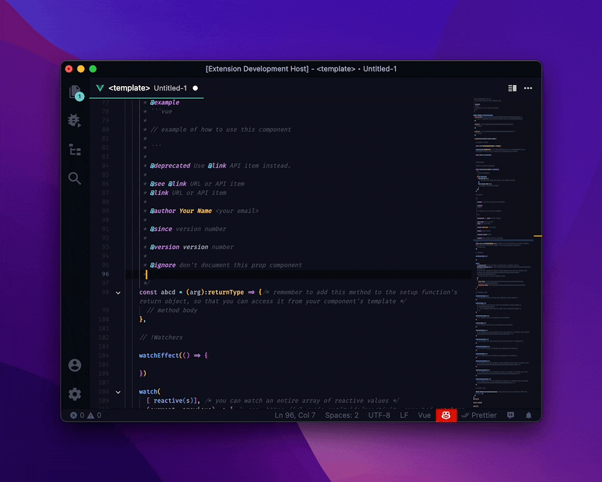

# Vue 3 Snippets

If you want to write Vue code in VScode, you've probably already installed [Vetur](https://marketplace.visualstudio.com/items?itemName=octref.vetur). If you haven't, what are you waiting for? It's essential for Vue development! If you have, you've probably noticed that it provides several snippets for scaffolding Vue files, but it doesn't provide snippets for the _contents_ of those files. That's what these snippets are for. Add them to your editor, and they will help you organize and document your Vue components. Use it alongside Vetur for the best Vue development experience.

- **Stub Vue Single-File Components' setup function, with the `setup` snippet**

  

  If you've switched from Vue 2 to Vue 3, you've probably heard of the **Composition API**. If you haven't, it's a brand-new way to set your component's options. It [wraps all of the same functionality of the Options API in a `setup` function](https://www.vuemastery.com/courses/vue-3-essentials/why-the-composition-api/), rather than a configuration object. It's more flexible, and easier to debug. But, if you're like most Vue developers, you probably haven't _used_ it in your components. I get it. The API is new, and unfamiliar. It's another _thing_ you have to learn. The `setup` snippet lowers the Composition API's learning curve.

- **Document Vue Single-File Components, with the `/component` tag**

  

  The only thing harder than writing a new Vue component, is reading a component you wrote six months ago, and wondering "what was I thinking?" A component is only useful if you can remember how it works. Use the `/component` snippet to stub out a [Vue-Docgen](https://vue-styleguidist.github.io/docs/Docgen.html) block for your component.

## Usage

Use the following snippets to stub out options with the [Vue 3 Composition API](https://v3.vuejs.org/api/composition-api.html#composition-api)

| Function                                                                                                                                                                                                                                                                                                                   | Trigger                                                                                                  |
| -------------------------------------------------------------------------------------------------------------------------------------------------------------------------------------------------------------------------------------------------------------------------------------------------------------------------- | :------------------------------------------------------------------------------------------------------- |
| **[Setup Function](https://v3.vuejs.org/api/composition-api.html#setup)** Stubs out a function that initializes your component with all of the data, computed properties, watchers, lifecycle hooks, provides and injects that you would otherwise define using the Options API.                                       | `setup()`                                               |
| **[Provide Function](https://v3.vuejs.org/api/composition-api.html#provide-inject)** Stubs out a function that makes a property available to every descendent of your component.                                                                                                                                       | `provide()`                                |
| **[Inject Function](https://v3.vuejs.org/api/composition-api.html#provide-inject)** Stubs out a statement which injects an item that an ancestor provides your component.                                                                                                                                              | `const inject =`                             |
| **[Computed Property Function](https://v3.vuejs.org/api/computed-watch-api.html#computed)** Stubs out a function that defines a reactive computed property.                                                                                                                                                            | `computed()`                    |
| **[Method](https://v3.vuejs.org/api/options-data.html#methods)** Stubs out a single method.                                                                                                                                                                                                                            | `method()`                                            |
| **[WatchEffect Function](https://v3.vuejs.org/api/computed-watch-api.html#watcheffect)** Stubs out a function that defines a callback that runs when a property changes.                                                                                                                                               | `watchEffect()`                    |
| **[Watch Function](https://v3.vuejs.org/api/computed-watch-api.html#watch)** Stubs out a function that defines a callback that runs when a property changes. Unlike `watchEffect()`, watch receives both the previous and current value of a property, so that you can conditionally run code based on the difference. | `watch()`                                      |
| **[OnBeforeMount Function](https://v3.vuejs.org/api/composition-api.html#lifecycle-hooks)** Stubs out a function that runs code before your component is mounted.                                                                                                                                                      | `onBeforeMount()`              |
| **[onMounted Function](https://v3.vuejs.org/api/composition-api.html#lifecycle-hooks)** Stubs out a function that runs code as soon as your component is mounted.                                                                                                                                                      | `onMounted()`                          |
| **[onBeforeUpdate Function](https://v3.vuejs.org/api/composition-api.html#lifecycle-hooks)** Stubs out a function that runs code before your component is patched with changes to the DOM.                                                                                                                             | `onBeforeUpdate()`           |
| **[onUpdated Function](https://v3.vuejs.org/api/composition-api.html#lifecycle-hooks)** Stubs out a function that runs code as soon as your component is patched with changes to the DOM.                                                                                                                              | `onUpdated()`                          |
| **[onActivated Function](https://v3.vuejs.org/api/composition-api.html#lifecycle-hooks)** Stubs out a function that runs code when your kept-alive component is activated.                                                                                                                                             | `onActivated()`                    |
| **[onDeactivated Function](https://v3.vuejs.org/api/composition-api.html#lifecycle-hooks)** Stubs out a function that runs code before your kept-alive component is deactivated.                                                                                                                                       | `onDeactivated()`              |
| **[onBeforeUnmount Function](https://v3.vuejs.org/api/composition-api.html#lifecycle-hooks)** Stubs out a function that runs code before your component is unmounted.                                                                                                                                                  | `onBeforeUnmount()`        |
| **[onUnmounted Function](https://v3.vuejs.org/api/composition-api.html#lifecycle-hooks)** Stubs out a function that runs code as soon as your component is unmounted.                                                                                                                                                  | `onUnmounted()`                    |
| **[onErrorCaptured Function](https://v3.vuejs.org/api/composition-api.html#lifecycle-hooks)** Stubs out a function that runs code whenever an error occurs in your component.                                                                                                                                          | `onErrorCaptured()`        |
| **[onRenderTracked Function](https://v3.vuejs.org/api/composition-api.html#lifecycle-hooks)** Stubs out a function that runs code as soon as your component is rendered.                                                                                                                                               | `onRenderTracked()`        |
| **[onRenderTriggered Function](https://v3.vuejs.org/api/composition-api.html#lifecycle-hooks)** Stubs out a function that runs code as soon as a change elsewhere in the Virtual DOM triggers a re-render of your component.                                                                                           | `onRenderTriggered()`  |

Use the following snippets to stub [Vue Docgen](https://vue-styleguidist.github.io/docs/Docgen.html#vue-docgen-api) sections and tags.

| Section                                                                                                                                                                                                             | Trigger                                                                        |
| :------------------------------------------------------------------------------------------------------------------------------------------------------------------------------------------------------------------ | :----------------------------------------------------------------------------- |
| **[component](https://vue-styleguidist.github.io/docs/Documenting.html#available-tags)** Describes the purpose and behavior of the component. Place it directly above a component's `export default` statement. | `/component`  |
| **[slot](https://vue-styleguidist.github.io/docs/Documenting.html#slots)** Describes what can be inserted into the slot it documents.                                                                           | `/slot`                 |
| **[event](https://vue-styleguidist.github.io/docs/Documenting.html#events)** Lists the event(s) that the are `$emit(...)`ed by the method or watcher it documents.                                              | `/event`              |

| Tag                                                                                                                                                                                      | Trigger                                                             |
| :--------------------------------------------------------------------------------------------------------------------------------------------------------------------------------------- | :------------------------------------------------------------------ |
| **[@values](https://vue-styleguidist.github.io/docs/Documenting.html#values)** Lists the values a prop can take.                                                                     | `@values`          |
| **[@example](https://vue-styleguidist.github.io/docs/Documenting.html#example)** Shows an example of how to use the code it documents.                                               | `@example`       |
| **[@deprecated](https://vue-styleguidist.github.io/docs/Documenting.html#deprecated)** Deprecates the code it documents, and links to the replacement code.                          | `@deprecated`  |
| **[@see](https://vue-styleguidist.github.io/docs/Documenting.html#see-link)** Links to another section of the documentation, or to a website.                                        | `@see`                |
| **[@link](https://vue-styleguidist.github.io/docs/Documenting.html#see-link)** Links to another section of the documentation, or to a website.                                       | `@link`              |
| **[@author](https://vue-styleguidist.github.io/docs/Documenting.html#author)** List the name and author of the person who wrote the code.                                            | `@author`          |
| **[@since](https://vue-styleguidist.github.io/docs/Documenting.html#since)** Lists the version that the code it documents first appeared in the codebase.                            | `@since`            |
| **[@version](https://vue-styleguidist.github.io/docs/Documenting.html#version)** Lists the [current semantic version](https://jsdoc.app/tags-version.html) of the code it documents. | `@version`        |
| **[@ignore](https://vue-styleguidist.github.io/docs/Documenting.html#ignore)** Excludes the documentation from autogenerated documentation sites.                                    | `@ignore`          |
| **[@param](http://usejsdoc.org/tags-param.html)** Describes the values that the method it documents accepts for an argument.                                                         | `@param`            |

## Roadmap

See [`CHANGELOG.md`](./CHANGELOG.md)

## Contribute to Vue 3 Snippets

### Repository Structure:

| File or Folder  | What does it do?                                                                                               | When should you modify it?                                                              |
| :-------------- | :------------------------------------------------------------------------------------------------------------- | :-------------------------------------------------------------------------------------- |
| `.readme/`      | Contains all of the images used in this README. Note that everything in this folder is versioned with Git LFS. | Whenever you need to add or change the images used in this README.                      |
| `snippets/*`    | Contains all of the [snippets](#usage) that this extension provides.                                           | Whenever you need to change any of the [snippets](#usage) that this extension provides. |
| `.vscodeignore` | Lists the files that will not be included in this extension when its' published.                               | Never.                                                                                  |
| `CHANGELOG.md`  | Lists the changes that each version introduces.                                                                | Whenever you increment this package's version in [`package.json`](./package.json)       |
| `package.json`  | Describes the contents, scripts, and configuration details of this extension.                                  | Whenever you need to release a new version of this package.                             |
| `README.md`     | This file.                                                                                                     | Whenever you add or change a snippet in this extension.                                 |

### Develop:

See [Visual Studio Code ➝ Create your own snippets](https://code.visualstudio.com/docs/editor/userdefinedsnippets#_create-your-own-snippets)

### Test:

1. Open this project in VScode. Then, press [`F5`]() to load the snippets in a new VScode window.

   

2. Create a new Vue file, or open an existing one.

   

3. Test the snippets you just made.

   

4. Whenever you save changes to the snippets, hit the 'reload' button in the debugger tray to send the changes to the VScode window.

   

<!--
  to publish:

  go to https://dev.azure.com/<publisher-name>/_usersSettings/tokens where <publisher-name> is the user account under which this extension is published

  get a personal access token (see: https://code.visualstudio.com/api/working-with-extensions/publishing-extension#get-a-personal-access-token )

  then `vsce login <publisher-name>` and supply the personal access token you just got.

  then increment the version number in `package.json`, add an entry for that vesion number ot `CHANGELOG.md` and finally `vsce publish`.
 -->
